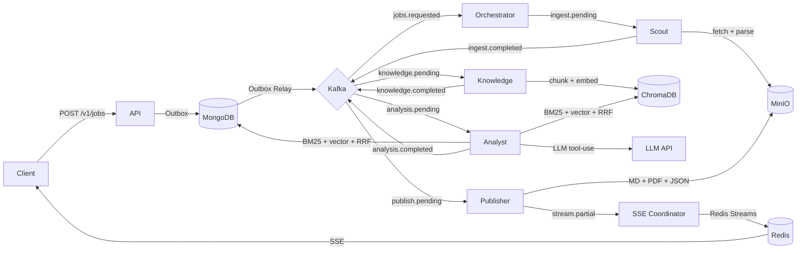

<div align="center">

# ⚡ TrendStorm AI

**Autonomous multi-agent trend intelligence — from sources to cited report in real time.**

[](https://python.org)
[](https://fastapi.tiangolo.com)
[](https://kafka.apache.org)
[](https://mongodb.com)
[](https://langchain-ai.github.io/langgraph/)
[](https://docs.astral.sh/uv/)

</div>

---

## What it does

A tenant registers a **category** (e.g. "AI Safety Research") with **sources** (RSS feeds, web pages, JSON APIs, sitemaps). Submitting a **job** triggers a 9-service Kafka-orchestrated pipeline that fetches, embeds, retrieves, analyzes, and streams a grounded, cited trend report back to the client — live, via SSE.

```
POST /v1/jobs  ──►  Scout  ──►  Knowledge  ──►  Analyst  ──►  Publisher  ──►  SSE stream
                   (fetch)     (chunk+embed)   (RAG+LLM)    (MD/PDF/JSON)   (real-time)
```

**Key design properties:**
- 🔀 **Event-driven** — Kafka decouples every stage; any worker can be restarted independently
- 🏛️ **Hexagonal** — domain Protocols, infrastructure implementations, composable services  
- 🏢 **Multi-tenant from day one** — every Mongo query is scoped by `tenant_id`
- 📊 **Three-pillar observability** — OTel traces (Jaeger) · Prometheus metrics (Grafana) · structured logs (Loki)
- ☸️ **Kubernetes-ready** — Helm chart with KEDA autoscaling and Argo Rollouts canary

---

## Pipeline



---

## Services

| Service | Role | Scales on |
|---|---|---|
| `api` | FastAPI HTTP + SSE, port 8080 | CPU + connections |
| `orchestrator-worker` | LangGraph state machine (job lifecycle) | Kafka lag |
| `scout-worker` | Fetch, parse, deduplicate sources | Kafka lag |
| `knowledge-worker` | Chunk text + embed into ChromaDB | Kafka lag |
| `analyst-worker` | Hybrid RAG retrieval + LLM analysis + validation | Kafka lag |
| `publisher-worker` | Render Markdown / JSON / PDF, upload to MinIO | Kafka lag |
| `sse-coordinator-worker` | Kafka → Redis Streams → live SSE fanout | Kafka lag |
| `production-eval-worker` | 1% production sample evaluation | Kafka lag |
| `outbox-relay-worker` | MongoDB outbox → Kafka (atomic job creation) | 1–2 replicas |
| `review-timeout-worker` | Auto-reject HITL reviews past SLA (single replica Recreate) | N/A |

---

## Using the SDK

```bash
pip install trendstorm
```

```python
import asyncio
from trendstorm_sdk import TrendStormClient

async def main():
    async with TrendStormClient(api_key="ts_live_...") as ts:
        # Create a category and register sources
        cat = await ts.categories.create(name="AI Safety", keywords=["alignment"])
        src = await ts.sources.add(category_id=cat.id, url="https://arxiv.org/rss/cs.AI")

        # Submit and stream a job
        job = await ts.jobs.create(category_id=cat.id, source_ids=[src.id])
        async for event in ts.jobs.stream(job.job_id):
            print(event.event_type.value, event.payload)
            if event.event_type.is_terminal:
                break

asyncio.run(main())
```

Full SDK docs: [sdk/python/README.md](sdk/python/README.md) · [sdk/python/examples/](sdk/python/examples/)

---

## Tech stack

| Layer | Technology |
|---|---|
| **API** | FastAPI + Uvicorn + sse-starlette |
| **Orchestration** | LangGraph 0.2.x + MongoDB checkpointer |
| **Messaging** | Kafka KRaft (no ZooKeeper) + aiokafka |
| **Storage** | MongoDB (replica set) · Redis · MinIO (S3) · ChromaDB |
| **LLMs** | Anthropic Claude · Gemini · OpenAI · Ollama (local) |
| **Retrieval** | BM25 (Mongo `$text`) + dense (ChromaDB) + RRF + Cohere rerank |
| **Observability** | OpenTelemetry → Jaeger · Prometheus → Grafana · Loki |
| **Deployment** | Helm · KEDA · Argo Rollouts · ExternalSecrets · Linkerd |
| **Tooling** | uv · ruff · mypy strict · pytest |

---

## Quick start

### Prerequisites

- Python 3.12+ and **[uv](https://docs.astral.sh/uv/)**
- Docker Desktop with **≥ 8 GB RAM** and Compose v2 (`docker compose`, not `docker-compose`)
- `make`

### 1 — Clone and install

```bash
git clone <repo-url>
cd trendstorm
uv sync --all-groups
cp .env.example .env.local
# Edit .env.local — add at least one LLM key:
#   LLM__ANTHROPIC_API_KEY=sk-ant-...
#   LLM__GEMINI__API_KEY=AIza...    (free tier, used for embeddings)
```

### 2 — Start infrastructure

```bash
make up           # Mongo + Kafka + Redis + ChromaDB + MinIO + Ollama (~30 s)
make seed-indexes # Create all MongoDB indexes (idempotent)
make check        # Verify all services are healthy
```

### 3 — (Optional) Observability

```bash
make up-obs
# Grafana:    http://localhost:3000  (admin / admin)
# Jaeger:     http://localhost:16686
# Prometheus: http://localhost:9090
```

### 4 — Start the application

```bash
make up-app
# API + Swagger: http://localhost:8080/docs
```

### 5 — Run a smoke test

```bash
make smoke    # Mongo · Kafka · Redis sanity check
make test     # 888 unit tests, no Docker required
```

---

## Make targets

<details>
<summary><b>Infrastructure</b></summary>

| Target | Description |
|---|---|
| `make up` | Start core stack (Mongo, Kafka, Redis, ChromaDB, MinIO, Ollama) |
| `make up-obs` | Add observability (OTel Collector, Jaeger, Prometheus, Loki, Grafana) |
| `make up-app` | Add api + all 9 workers |
| `make up-all` | Everything at once |
| `make down` | Stop all services (volumes preserved) |
| `make nuke` | **Destructive** — stop + delete all volumes |
| `make restart` | Restart core stack |
| `make ps` | Show service health |
| `make logs` | Tail all service logs |
| `make seed-indexes` | Create all MongoDB indexes (idempotent) |
| `make check` | Full health check |

</details>

<details>
<summary><b>Testing & quality</b></summary>

| Target | Description |
|---|---|
| `make test` | Unit tests — no Docker required |
| `make test-integration` | Integration tests — requires `make up` |
| `make test-all` | Everything |
| `make smoke` | End-to-end smoke test |
| `make eval-fast` | Deterministic evals on golden dataset (no LLM keys) |
| `make eval-full` | Full eval suite including LLM judges |
| `make eval-check` | CI gate — fail if threshold violations in last eval |
| `make lint` | ruff check |
| `make format` | ruff format (auto-fix) |
| `make typecheck` | mypy strict |
| `make check-all` | lint + typecheck + test |

</details>

<details>
<summary><b>Local dev & debugging</b></summary>

| Target | Description |
|---|---|
| `make run-dev` | Run API locally with console logging + DEBUG |
| `make run-worker-dev` | Run orchestrator worker locally |
| `make mongo-shell` | mongosh against the replica set |
| `make redis-cli` | redis-cli |
| `make kafka-topics` | List Kafka topics |
| `make kafka-describe` | Topic partition/config details |
| `make ollama-list` | List installed Ollama models |
| `make logs-api` | Tail API container logs |
| `make logs-scout` | Tail scout worker logs |
| `make helm-lint` | Lint Helm chart |
| `make helm-template` | Preview rendered templates |

</details>

---

## Project structure

```
src/trendstorm/
├── shared/          config, logging, tracing, errors, ids, metrics, rate_limit
├── api/             FastAPI app · middleware · routers · error_handlers · deps
├── domain/          jobs · categories · sources · documents · chunks · analyses
│                    reports · outbox · auth · billing · llm · vectors · evaluation
├── infrastructure/
│   ├── mongo/       client · schema · indexes · repositories/
│   ├── kafka/       producer · consumer (BaseConsumer)
│   ├── redis/       client · streams · pubsub
│   ├── llm/         anthropic · gemini · openai · ollama · retry · registry
│   ├── vectors/     chroma_store
│   ├── blob/        minio_client · uri
│   ├── retrieval/   mongo_bm25 · chroma_vector · cohere_reranker
│   └── auth/        api_key · jwt
├── agents/          stages · state · orchestrator/ · knowledge/ · publisher/
├── orchestration/   topics · events · workers/ (9 workers)
└── services/        job · category · source · retrieval/ · analysis/
                     publish/ · streaming/ · auth/ · billing/ · evaluation/
tests/
├── unit/            pure functions, no Docker  (-m unit)
└── integration/     full stack via `make up`   (-m integration)
```

---

## Configuration

All settings map to environment variables with `SUBSYSTEM__KEY` double-underscore notation (Pydantic nested model mapping). Copy `.env.example` to `.env.local` and fill in secrets — `.env.local` is gitignored and takes precedence.

**Required for local dev:**

```bash
# At least one LLM provider
LLM__ANTHROPIC_API_KEY=sk-ant-...
LLM__GEMINI__API_KEY=AIza...       # free tier; used for embeddings by default

# Optional
LLM__OPENAI_API_KEY=sk-...
LLM__COHERE_API_KEY=...            # Cohere reranker (retrieval quality boost)

# Auth (disabled is correct for local dev; production refuses this)
AUTH__MODE=disabled
APP__ENV=local
APP__LOG_FORMAT=console            # human-readable for local dev
```

All infrastructure URLs default to Docker Compose service names. For running workers locally against Docker, `.env.local.example` has the `localhost`-mapped port overrides.

---

## Development workflow

```bash
make check-all    # lint + typecheck + unit tests — run before every commit
make eval-fast    # run before any PR that touches prompts, retrieval, or LLM config
```

VSCode users: open the project and accept the recommended extensions prompt. Debug configs for all 9 workers are in `.vscode/launch.json`. See [docs/dev-environment.md](docs/dev-environment.md) for details.

---

## Production deployment

```bash
# Preview what would be deployed
make helm-template

# Deploy (CI sets imageTag)
helm upgrade --install trendstorm helm/trendstorm \
  -f helm/trendstorm/values-production.yaml \
  --set image.tag=$(git rev-parse --short HEAD)
```

- Workers autoscale on Kafka consumer lag via **KEDA**
- API autoscales on CPU via **HPA**
- API rollouts use **Argo Rollouts** canary (10% → 50% → 100%) gated on HTTP 5xx error rate < 1%
- Secrets managed via **ExternalSecrets** from AWS SSM

See [ops/runbooks/](ops/runbooks/) for operational procedures and alert runbooks.

---

## Troubleshooting

<details>
<summary><b>Mongo replica set not initializing</b></summary>

Replica set state persists in the Docker volume. A half-initialized state requires a clean restart:

```bash
make nuke && make up
```

</details>

<details>
<summary><b>Kafka producer hangs when running workers locally</b></summary>

Workers running on the host must use the host-facing Kafka listener on port `29092`, not the container-internal `9092`. See `.env.local.example` for the correct `KAFKA__BOOTSTRAP_SERVERS` value.

</details>

<details>
<summary><b>Ollama models not showing up</b></summary>

The initial model pull takes 2–5 minutes. Watch progress with:

```bash
make logs | grep ollama-init
```

</details>

<details>
<summary><b>PDF rendering fails locally</b></summary>

`weasyprint` requires GTK/Pango system libs not present on macOS without extra setup. PDF output is best-effort — the pipeline continues without it. The Docker image includes the required libs.

</details>

---

## Documentation

| Resource | |
|---|---|
| [CLAUDE.md](CLAUDE.md) | Engineering context — all patterns, hard rules, architecture decisions |
| [docs/architecture-history/](docs/architecture-history/) | Per-phase implementation summaries (Phases 1–12) |
| [docs/adr/](docs/adr/) | Architecture Decision Records |
| [ops/runbooks/](ops/runbooks/) | Operational runbooks for every Prometheus alert |
| [ops/slo.yml](ops/slo.yml) | SLO definitions (13 objectives) |
| [docs/dev-environment.md](docs/dev-environment.md) | VSCode workspace setup and debug workflow |
| [docs/api-examples/](docs/api-examples/) | REST Client `.http` files for all common operations |
